# Mirror-GUI Application

A modern web-based interface for managing OpenShift Container Platform mirroring operations using oc-mirror v2. Create, manage, and execute mirror configurations without command-line expertise.

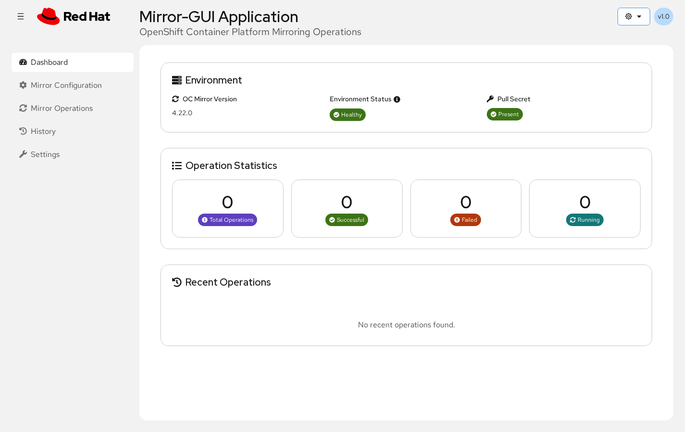

---

## Quick Start

### Prerequisites

- **Podman** (required)
- **oc client** (required for building) — download from [mirror.openshift.com](https://mirror.openshift.com/pub/openshift-v4/clients/ocp/stable/)
- **Pull secret** from [console.redhat.com](https://console.redhat.com/openshift/downloads#tool-pull-secret) (required — save to `pull-secret/pull-secret.json` before building, or run `podman login registry.redhat.io`)

### Clone the repository

```bash
git clone https://github.com/openshift/mirror-gui.git
cd mirror-gui
```

### Build and run

```bash
chmod +x local-build.sh

# Build and run locally (fetches catalogs, builds image, starts container)
./local-build.sh

# Build only, without starting the container
./local-build.sh --build

# Run a previously built image without rebuilding or fetching catalogs
./local-build.sh --run
```

Every build path runs `sync-catalogs.sh` to pull the latest Red Hat, Certified, and Community operator catalogs (OCP 4.16-4.22) before building the image. Use `--run` to skip fetching and building when you already have a local image.

Open the URL printed by the script in your browser. By default it uses **http://localhost:3000**, but it automatically selects another free host port if `3000` is already in use. If a different port is chosen, use the `Web UI:` line printed by the script output.

Manage with: `./local-build.sh --stop`, `./local-build.sh --restart`, `./local-build.sh --status`, `./local-build.sh --logs`.

---

## Features

### Dashboard

Environment overview (oc-mirror version, environment status, pull secret status), operation statistics, recent operations, and quick action buttons. Shows a warning banner when no pull secret is detected.


**Dark theme** -- Toggle between Light, Dark, and System (auto) themes from the masthead.

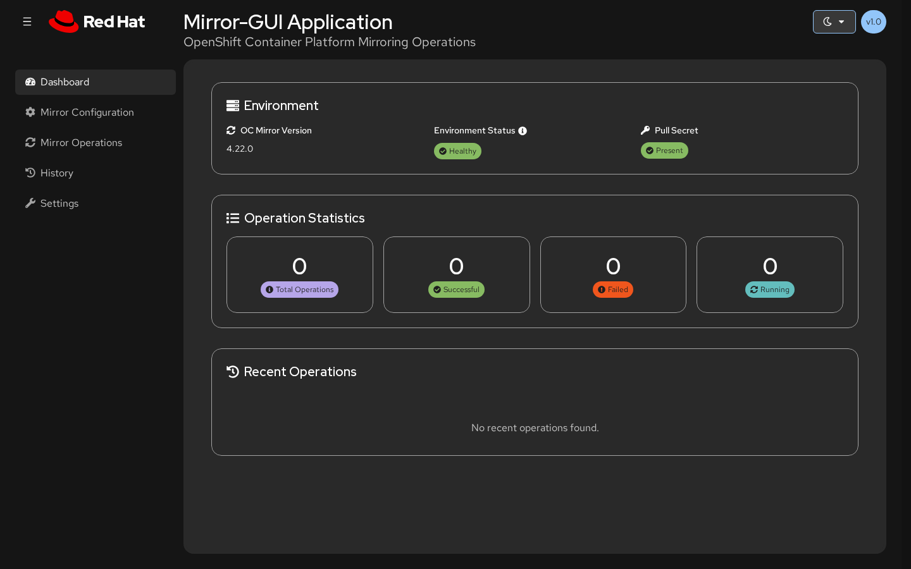

**When no pull secret is detected**, a warning banner is displayed with a link to the Settings page where one can be uploaded.

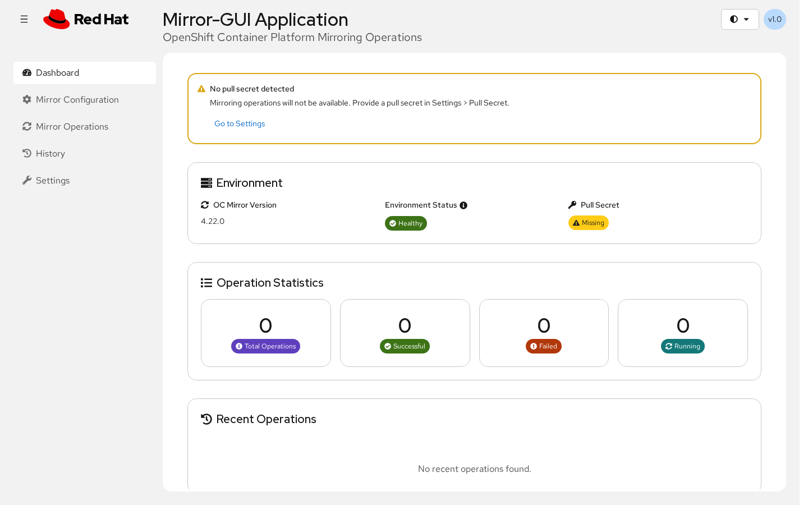

### Mirror Configuration

Visual configuration builder with tabs for Platform Channels, Operators, Additional Images, YAML Preview, and file upload.

**Adding operators** -- Select from pre-fetched catalogs (OCP 4.16-4.22) with Red Hat, Certified, and Community operator indexes. Automatic dependency detection with one-click add.

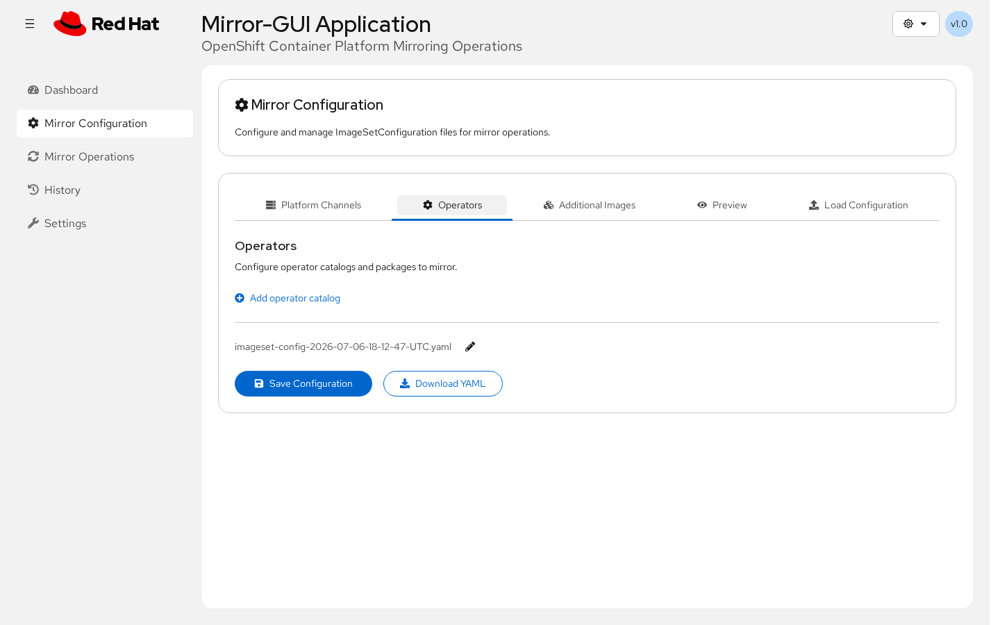

**YAML preview and editing** -- Preview the generated `ImageSetConfiguration` YAML, copy to clipboard, or edit directly. Set an optional archive size limit (in GiB) to control the maximum size of each archive file.

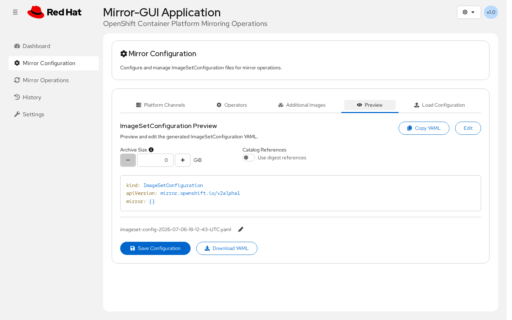

**Upload existing YAML** -- Import an existing `ImageSetConfiguration` YAML file, review and edit it, then save it or load it into the form editor for further modification.

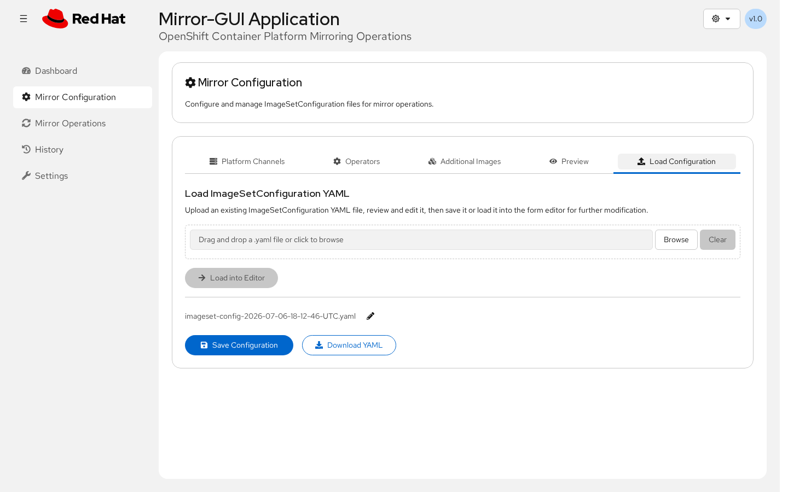

### Mirror Operations

Execute mirror operations with real-time monitoring. Select a saved configuration file, optionally specify a destination subdirectory, and start the operation. View operation history with logs, location info, and delete actions.

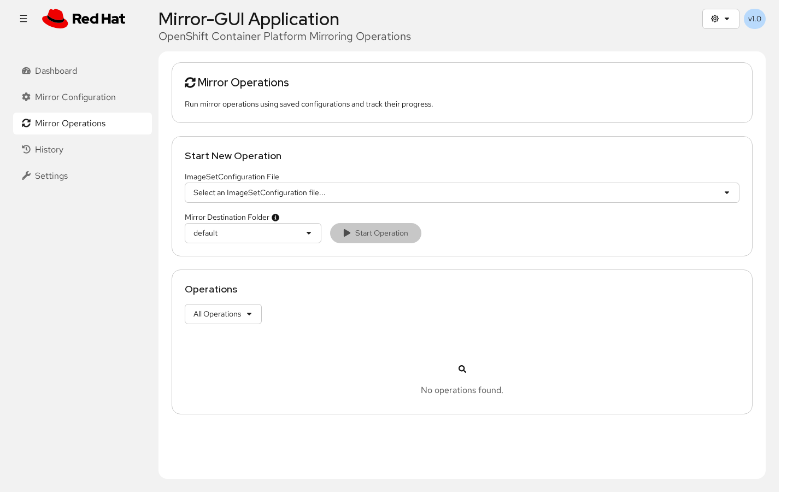

### History

Filter and review all past operations. Export to CSV.

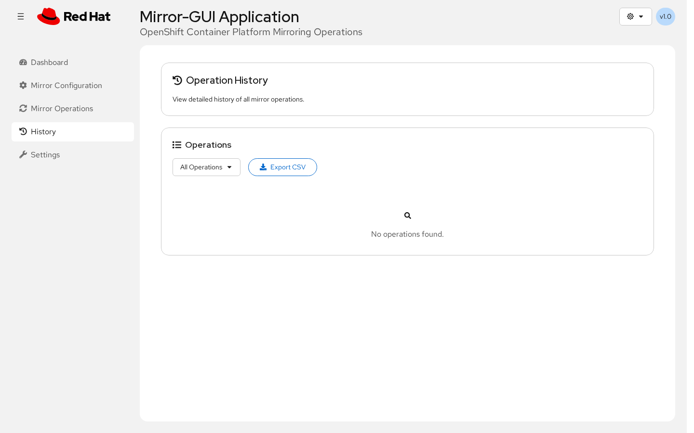

### Settings

Configure environment preferences across four tabs:

**Pull Secret** -- View, upload, edit, or remove your pull secret directly from the browser.

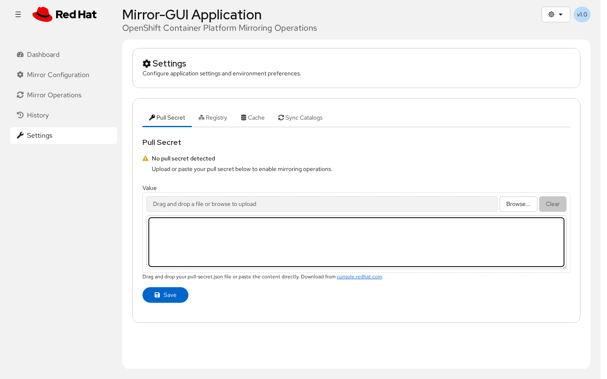

**Registry** -- Auto-detected registries from your pull secret with authentication verification.

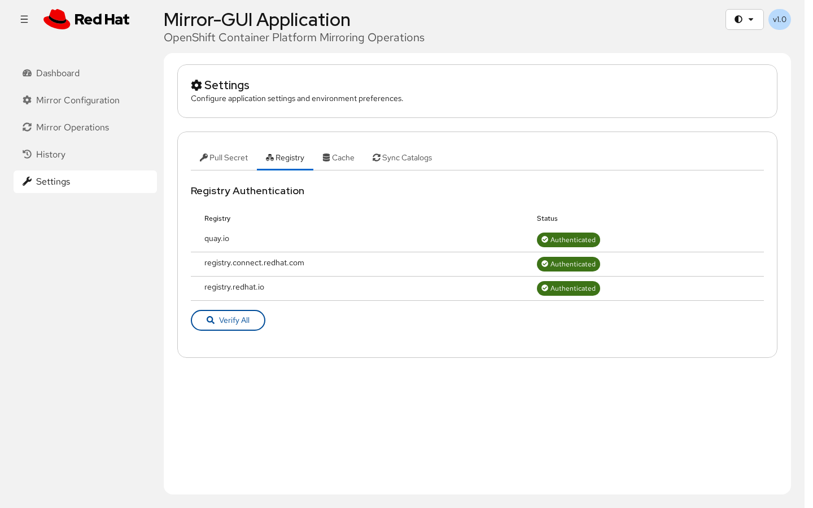

**Cache** -- View cache location and size, clean up cache data.

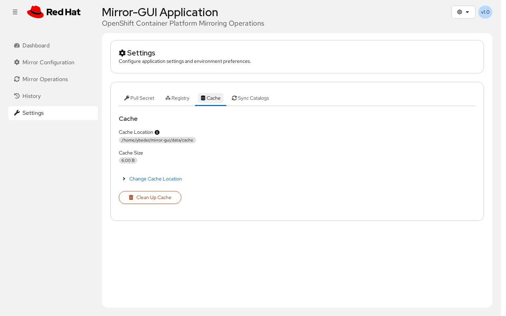

**Sync Catalogs** -- Fetch the latest operator catalog metadata from registry.redhat.io for all supported OCP versions. View sync status, progress, and logs.

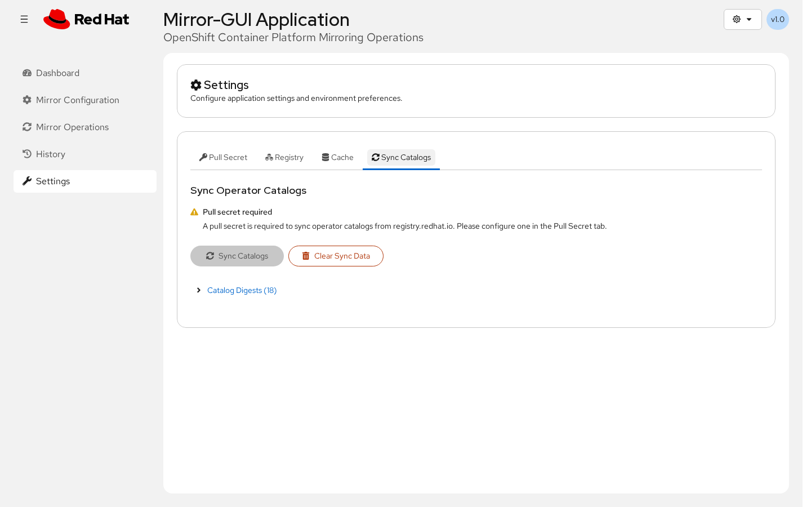

| Environment variable | Description |
|---|---|
| `IMAGE_NAME` | Override the container image |
| `WEB_PORT` | Override the host port (default: 3000) |
| `CACHE_DIR` | Override the oc-mirror cache directory (absolute host path) |

---

## Compatibility

| | |
|---|---|
| **oc-mirror** | v2 |
| **OpenShift** | 4.16, 4.17, 4.18, 4.19, 4.20, 4.21, 4.22 |
| **Container runtime** | Podman 5.0+ |
| **Architecture** | AMD64 (x86_64), ARM64 (aarch64) |

---

## Troubleshooting

**Invalid GPG signature for operator index images** -- See [Red Hat KB article](https://access.redhat.com/solutions/6542281).

---

## API

Full RESTful API documentation is available in [API.md](API.md).

## Contributing

1. Fork the repository
2. Create a feature branch
3. Make your changes and test
4. Submit a pull request

## License

Apache License 2.0 -- see [LICENSE](LICENSE) for details.
